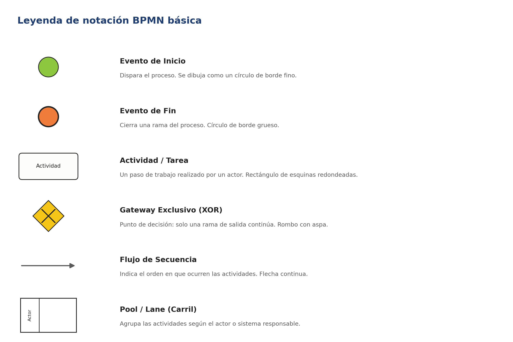
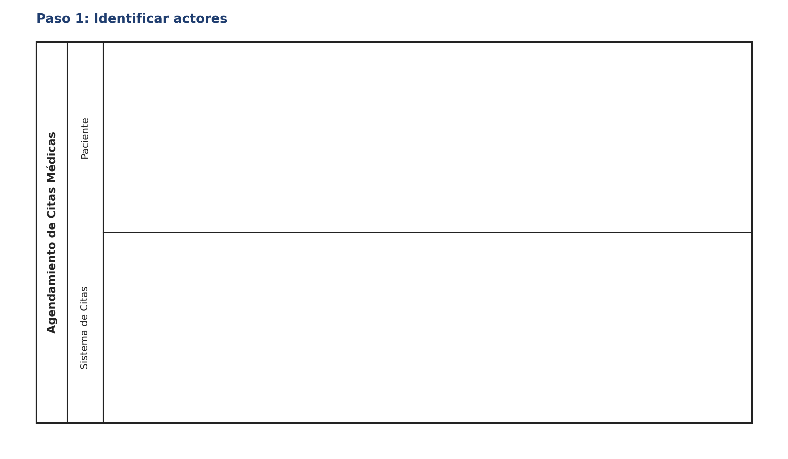
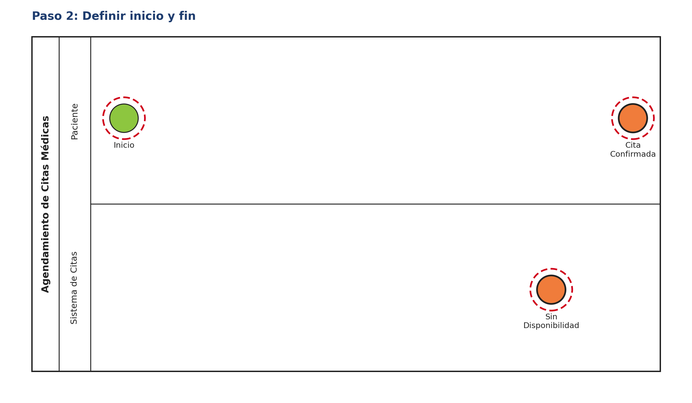
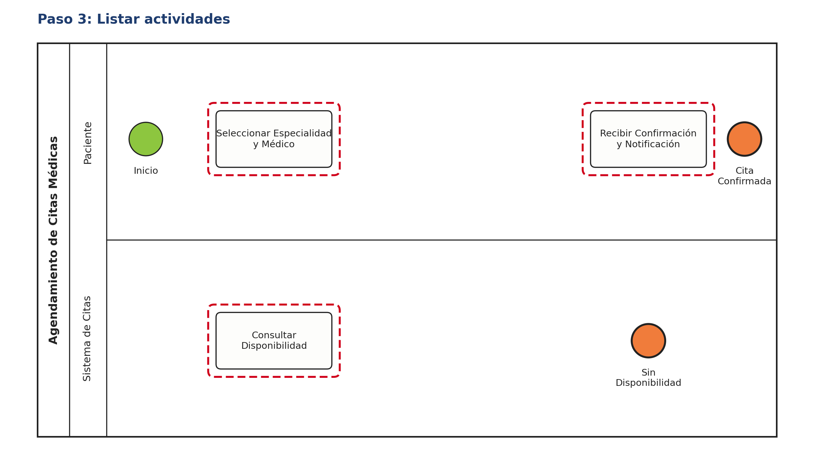
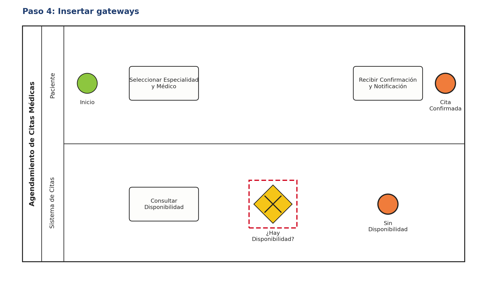
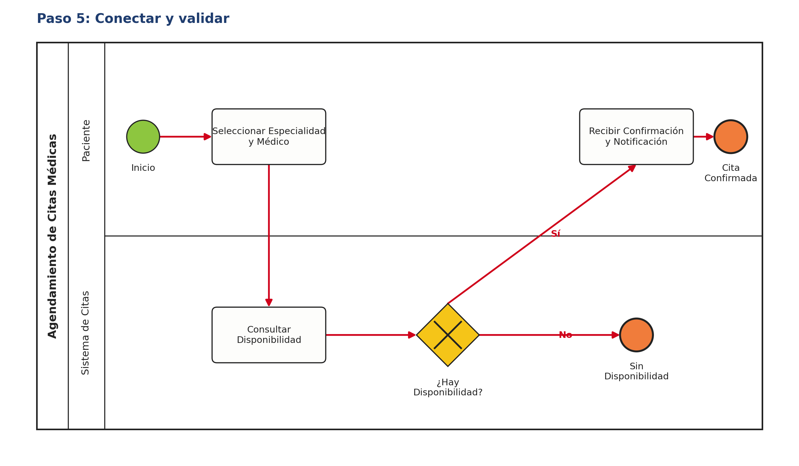
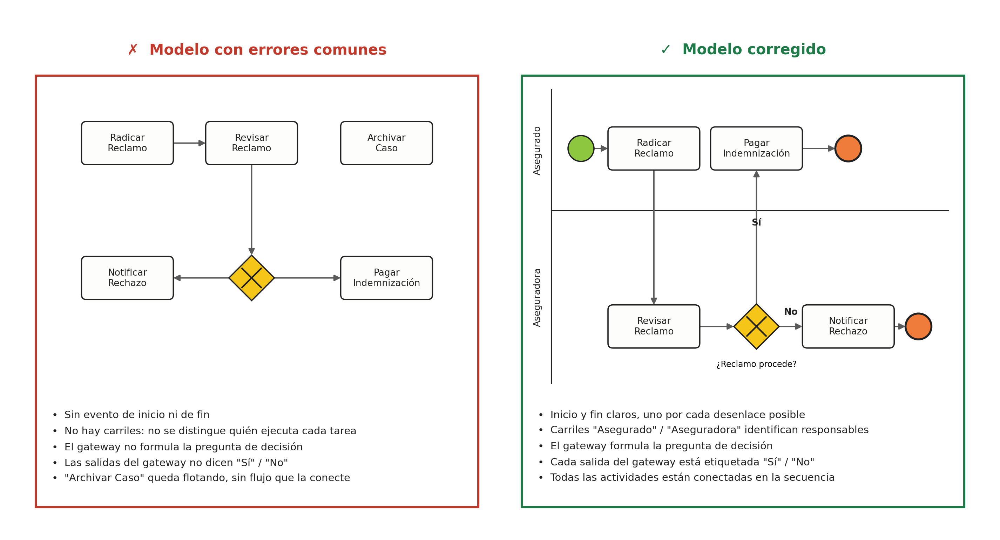

# 🧭 Guía Paso a Paso: Cómo Modelar un Proceso en BPMN

Esta guía complementa el `README.md` del taller. Su objetivo es que, antes de modelar el proceso de **Agendamiento de Citas Médicas** en clase (Parte 1) o el proceso de su cliente real (Parte 2), el equipo tenga una referencia clara de la notación BPMN y de la metodología para construir el diagrama desde cero.

---

## 1. Leyenda de notación BPMN básica

Estos son los símbolos mínimos que debe usar todo diagrama del taller. Cualquier elemento adicional (eventos intermedios, tareas de usuario/servicio, gateways paralelos, etc.) es opcional y solo se recomienda si el proceso realmente lo necesita.

---

## 2. Metodología en 5 pasos

Siga siempre este orden. No empiece dibujando flechas: empiece identificando quién participa.

1. **Identificar actores** — liste las personas, roles o sistemas que participan en el proceso. Cada uno será un carril (*lane*) dentro del pool.
2. **Definir inicio y fin** — determine qué dispara el proceso (evento de inicio) y cuáles son sus posibles desenlaces (uno o varios eventos de fin).
3. **Listar actividades** — anote, en orden aproximado, las tareas que cada actor ejecuta. En esta etapa aún no se conectan con flechas.
4. **Insertar gateways** — identifique los puntos donde el flujo puede tomar más de un camino y formule la pregunta de decisión de cada uno.
5. **Conectar y validar** — una todos los elementos con flujos de secuencia, etiquete las salidas de cada gateway ("Sí"/"No" u otras condiciones) y revise que no queden actividades sueltas ni caminos sin evento de fin.

---

## 3. Ejemplo guiado: Agendamiento de Citas Médicas (Clínica Salud Viva)

Este es el mismo caso base descrito en el `README.md`. A continuación se construye el diagrama siguiendo, paso a paso, la metodología de la sección anterior. Úselo como referencia de método — no como plantilla para copiar, ya que en clase el docente puede ajustar el alcance del proceso.

### Paso 1 — Identificar actores

Se determinan los dos participantes del proceso: el **Paciente**, que solicita la cita, y el **Sistema de Citas**, que valida disponibilidad y confirma. Cada uno se representa como un carril dentro del pool "Agendamiento de Citas Médicas".

### Paso 2 — Definir inicio y fin

El proceso inicia cuando el paciente decide agendar una cita. Se identifican también los dos desenlaces posibles: que la cita quede **confirmada** o que **no haya disponibilidad**. Definir esto antes que las actividades evita el error más común: diagramas sin evento de fin.

### Paso 3 — Listar actividades

Se anota, actor por actor, qué hace cada uno: el paciente selecciona especialidad y médico; el sistema consulta disponibilidad y, más adelante, notifica la confirmación. Nótese que en este paso las actividades aún no están conectadas — el objetivo es solo inventariarlas.

### Paso 4 — Insertar gateways

Se identifica el único punto de decisión del proceso: **¿hay disponibilidad?** Este gateway exclusivo (XOR) es el que determinará si el flujo continúa hacia la confirmación o hacia el cierre sin cita.

### Paso 5 — Conectar y validar

Se trazan los flujos de secuencia en el orden correcto y se etiquetan las dos salidas del gateway ("Sí" / "No"). Antes de dar por terminado el modelo, se valida que: todo camino termine en un evento de fin, el gateway tenga su pregunta y cada carril refleje solo las actividades de su actor.

---

## 4. Errores comunes a evitar

La siguiente comparación resume los errores que con más frecuencia bajan puntos en la rúbrica del taller ("Claridad del diagrama BPMN") frente a su corrección.

---

## 5. Checklist de autoevaluación antes de entregar

Antes de subir `modelo.drawio` (Parte 1) o `modelo-final.drawio` (Parte 2), verifique:

- [ ] Cada actor relevante tiene su propio carril (lane).
- [ ] Existe exactamente un evento de inicio.
- [ ] Todo camino del proceso termina en un evento de fin.
- [ ] Todas las actividades están conectadas por flujos de secuencia — no hay elementos flotantes.
- [ ] Cada gateway tiene una pregunta de decisión clara.
- [ ] Cada salida de un gateway está etiquetada (Sí/No, u otra condición explícita).
- [ ] Los nombres de las actividades son verbos de acción claros (ej. "Consultar Disponibilidad", no "Disponibilidad").
- [ ] El diagrama se puede leer de izquierda a derecha sin que las líneas se crucen innecesariamente.

---

_Esta guía hace parte del Taller 1 de Modelado de Procesos con BPMN — curso Arquitectura Empresarial, Universidad de La Sabana._
