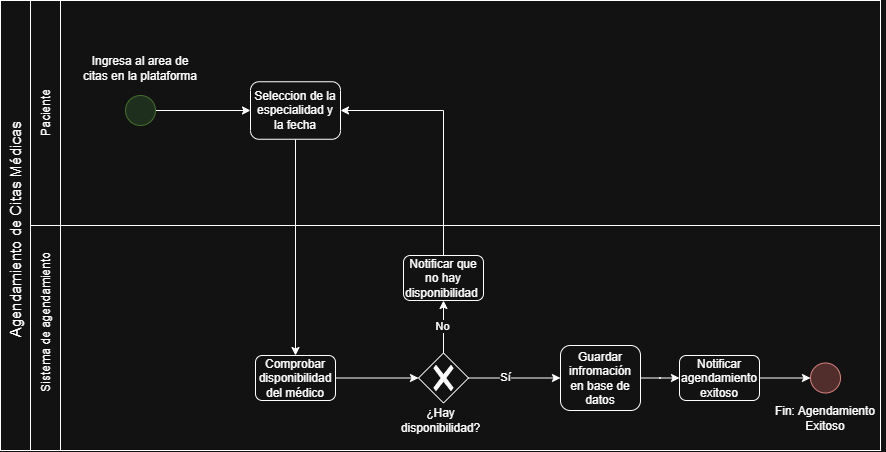

# 🗒️ Registro de Trabajo en Clase -  Taller 1: Modelado de Proceso del Cliente con BPMN "Parte 1 (Clínica Salud Viva)"

## 📆 Fecha de la sesión
7 a 10 AM - Sábado 1 de agosto de 2026.

## 👥 Integrantes presentes
- Brayan Presiga
- Jorge Alarcon
- Julián Aguirre

## 🧠 Actividades realizadas en clase

Describa brevemente qué se hizo durante la sesión:

1. Identifique los actores del proceso (¿quién participa? ¿qué rol cumple cada uno?).

   Se identificaron como actores del proceso Paciente y el Sistema de Agendamiento de la Clínica. El paciente cumple el rol de solicitante, quien inicia la transacción con el sistema para agendar su cita y el sistema se encarga de procesar esta solicitud, comprobando disponibilidad y guardando la cita en la base de datos.

2. Defina el evento de inicio y los posibles eventos de fin.

   Inicio: 

   - El paciente ingresa a la sección de agendamiento de citas de la plataforma de la clínica.

   Fin: 

   - Se pudo agendar la cita correctamente.

     Para ambos casos se envía mensaje para informar el caso via correo o mensaje de texto.

3. Liste las actividades principales de cada actor.

   Paciente

   - Ingresa datos de información personal contacto
   - Selección de fecha y especialidad

   Sistema

   - Guardar datos
   - Comprobar disponibilidad del médico
   - Enviar confirmación de agendamiento de cita correctamente
   - Enviar confirmación de falta de disponibilidad

4. Inserte los gateways (decisiones) y formule su pregunta.

   - ¿Hay disponibilidad?

5. ¿Qué herramientas se usaron (papel, pizarra, draw.io, Astah)?
   - Usamos Draw.io para realización de diagrama. 
6. ¿Qué parte del trabajo se alcanzó a desarrollar?
   - Se alcanzó a diseñar el diagrama y a explicarlo.
  

## 🧩 Boceto inicial del modelo

## 🔁 Tareas definidas para complementar el taller

Anote las responsabilidades acordadas entre los miembros del equipo para completar la entrega final:

| Tarea asignada | Responsable | Fecha estimada |
|----------------|-------------|----------------|
| Modelado final en draw.io | Julián Aguirre | 2/08 |
| Redacción del informe     | Brayan Presiga | 2/08 |
| Encargado del repositorio de Github | Jorge Alarcon | 2/08 |

---

_Este documento resume el trabajo colaborativo realizado durante la sesión del Taller 1: Modelado de Proceso del Cliente con BPMN
🎯 Objetivoen el curso AREM - Universidad de La Sabana._

